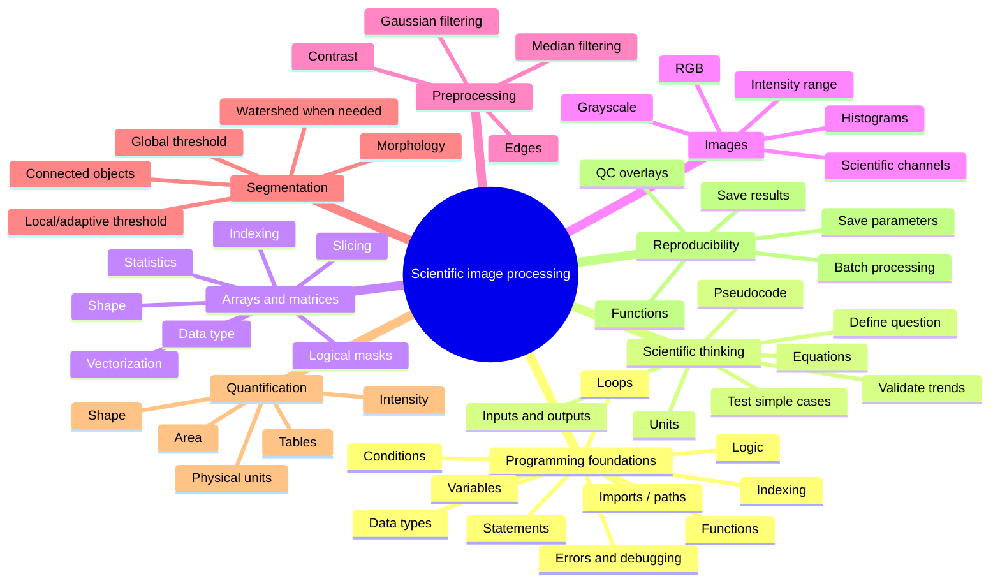

# Python + MATLAB Image Processing: A Practical Beginner Course

**Author: Md. Mobarak Karim, Ph.D.**

A beginner-friendly, self-contained course for learning **programming, scientific reasoning, and image processing** in either **Python** or **MATLAB**.

You do **not** need previous programming experience. Both tracks begin with variables, data types, statements, logic, loops, functions, debugging, mathematical equations, units, pseudocode, and problem decomposition before moving into image processing.

## Choose your learning track

### Python track

Start with:

1. [`00_setup_and_workflow.ipynb`](00_setup_and_workflow.ipynb)
2. [`01_python_numpy_for_images.ipynb`](01_python_numpy_for_images.ipynb) — the complete Python prerequisite
3. Continue through notebooks `02` to `10` in numerical order.

Python uses **NumPy, Matplotlib, scikit-image, pandas, imageio, and Jupyter**.

### MATLAB track

Open the [`MATLAB/`](MATLAB/) folder and start with:

1. [`MATLAB/00_setup_and_workflow.m`](MATLAB/00_setup_and_workflow.m)
2. [`MATLAB/01_matlab_foundations_for_images.m`](MATLAB/01_matlab_foundations_for_images.m) — the complete MATLAB prerequisite
3. Continue through MATLAB lessons `02` to `10` in numerical order.

The MATLAB lessons use `%%` sections, which behave like notebook cells inside the MATLAB Editor. Most image-processing lessons require **Image Processing Toolbox**.

For the full MATLAB roadmap, see [`MATLAB/README.md`](MATLAB/README.md).

## Learning philosophy

This course is designed around understanding, not copying code.

For programming and scientific equations, use this reasoning chain:

```text
question -> concept/equation -> inputs/units -> pseudocode -> code -> test -> validate -> apply
```

For image analysis, use this workflow:

```text
question -> inspect data -> preprocess only if needed -> segment -> validate -> measure -> save
```

For every important operation, ask:

1. What problem am I trying to solve?
2. What are my inputs and desired output?
3. What mathematical equation or logical rule describes the problem?
4. What are the units?
5. How do I translate the rule into code?
6. Why is this function appropriate?
7. Which parameter controls its behavior?
8. What could the operation damage or bias?
9. How will I validate the result?

## Shared learning mind map



## Python course order

| Notebook | Topic | What you learn |
|---|---|---|
| [`00_setup_and_workflow.ipynb`](00_setup_and_workflow.ipynb) | Setup + workflow | Environment, Jupyter, analysis habits |
| [`01_python_numpy_for_images.ipynb`](01_python_numpy_for_images.ipynb) | **Python foundations + scientific reasoning + NumPy** | Variables, types, collections, logic, loops, functions, imports, debugging, equations, pseudocode, units, NumPy, arrays, masks, images |
| [`02_read_display_and_image_types.ipynb`](02_read_display_and_image_types.ipynb) | Read/display/types | Grayscale/RGB, dtype, intensity range, safe I/O |
| [`03_contrast_histograms_and_intensity.ipynb`](03_contrast_histograms_and_intensity.ipynb) | Histograms + contrast | Intensity distributions and contrast decisions |
| [`04_filtering_noise_and_edges.ipynb`](04_filtering_noise_and_edges.ipynb) | Filtering + edges | Gaussian vs median, noise, edges |
| [`05_thresholding_and_morphology.ipynb`](05_thresholding_and_morphology.ipynb) | Thresholding + morphology | Binary masks and cleanup |
| [`06_segmentation_and_labels.ipynb`](06_segmentation_and_labels.ipynb) | Segmentation + labels | Connected components, overlays, watershed |
| [`07_measurements_and_tables.ipynb`](07_measurements_and_tables.ipynb) | Measurements | Object properties, pandas, physical units |
| [`08_color_and_multichannel_images.ipynb`](08_color_and_multichannel_images.ipynb) | Color + multichannel | RGB vs scientific channels |
| [`09_batch_processing_pipeline.ipynb`](09_batch_processing_pipeline.ipynb) | Batch pipeline | Reusable functions and multiple images |
| [`10_final_project.ipynb`](10_final_project.ipynb) | Final project | End-to-end validated analysis |

## MATLAB course order

| Lesson | Topic | What you learn |
|---|---|---|
| [`MATLAB/00_setup_and_workflow.m`](MATLAB/00_setup_and_workflow.m) | Setup + workflow | MATLAB Editor, workspace, paths, reproducibility |
| [`MATLAB/01_matlab_foundations_for_images.m`](MATLAB/01_matlab_foundations_for_images.m) | **MATLAB foundations + scientific reasoning** | Variables, matrices, indexing, element-wise math, logic, loops, functions, equations, pseudocode, debugging, images as arrays |
| [`MATLAB/02_read_display_and_image_types.m`](MATLAB/02_read_display_and_image_types.m) | Read/display/types | `imread`, grayscale/RGB, class, display vs data |
| [`MATLAB/03_contrast_histograms_and_intensity.m`](MATLAB/03_contrast_histograms_and_intensity.m) | Histograms + contrast | `imhist`, percentiles, `imadjust`, local enhancement |
| [`MATLAB/04_filtering_noise_and_edges.m`](MATLAB/04_filtering_noise_and_edges.m) | Filtering + edges | `imgaussfilt`, `medfilt2`, Sobel/Canny |
| [`MATLAB/05_thresholding_and_morphology.m`](MATLAB/05_thresholding_and_morphology.m) | Thresholding + morphology | Otsu/adaptive masks, cleanup, morphology |
| [`MATLAB/06_segmentation_and_labels.m`](MATLAB/06_segmentation_and_labels.m) | Segmentation + labels | Connected components, overlays, watershed |
| [`MATLAB/07_measurements_and_tables.m`](MATLAB/07_measurements_and_tables.m) | Measurements | `regionprops`, tables, calibration |
| [`MATLAB/08_color_and_multichannel_images.m`](MATLAB/08_color_and_multichannel_images.m) | Color + multichannel | RGB vs scientific channels |
| [`MATLAB/09_batch_processing_pipeline.m`](MATLAB/09_batch_processing_pipeline.m) | Batch pipeline | `dir`, `fullfile`, reusable functions |
| [`MATLAB/10_final_project.m`](MATLAB/10_final_project.m) | Final project | End-to-end MATLAB analysis and sensitivity testing |

## The foundation lessons are intentionally detailed

The two prerequisite lessons are designed so a complete beginner does not need another introductory programming course first:

- [`01_python_numpy_for_images.ipynb`](01_python_numpy_for_images.ipynb)
- [`MATLAB/01_matlab_foundations_for_images.m`](MATLAB/01_matlab_foundations_for_images.m)

They teach not only syntax, but **how to conceptualize a scientific problem and turn it into reliable code**.

Examples include:

- circle area,
- linear equations,
- exponential attenuation / Beer-Lambert-style models,
- Euclidean distance,
- normalization,
- Gaussian equations,
- pixel-to-physical-area conversion,
- logical object-selection rules,
- image masks and statistics.

The emphasis is always:

```text
original formula -> identify symbols -> define units -> choose variables -> translate operators -> test a known case -> check the expected physical trend
```

## Python companion guides

- [`FUNCTION_GUIDE.md`](FUNCTION_GUIDE.md) — which Python image-processing function to try and why.
- [`CHEATSHEET.md`](CHEATSHEET.md) — Python quick syntax reference.
- [`REFERENCES.md`](REFERENCES.md) — technical references.

## MATLAB companion guides

- [`MATLAB/MATLAB_FUNCTION_GUIDE.md`](MATLAB/MATLAB_FUNCTION_GUIDE.md) — which MATLAB image-processing function to try and why.
- [`MATLAB/MATLAB_CHEATSHEET.md`](MATLAB/MATLAB_CHEATSHEET.md) — MATLAB quick syntax reference.
- [`MATLAB/README.md`](MATLAB/README.md) — MATLAB-specific roadmap and setup notes.

## Python installation

### Miniforge / conda

```bash
conda env create -f environment.yml
conda activate pyimage-beginner
jupyter lab
```

### `venv` + pip

```bash
python -m venv .venv

# Windows
.venv\Scripts\activate

# macOS / Linux
source .venv/bin/activate

python -m pip install -r requirements.txt
jupyter lab
```

## MATLAB requirements

The MATLAB language foundation requires MATLAB. Most image-processing lessons use **Image Processing Toolbox**.

Inside MATLAB, check availability with:

```matlab
ver
which imgaussfilt
which imbinarize
which regionprops
```

## How to study effectively

For each lesson:

1. Read the explanation before the code.
2. Predict what the next code section should do.
3. Run it.
4. Inspect the output.
5. Change one value or parameter.
6. Explain what changed and why.
7. Complete the practice section.

For equations:

1. Write the original equation first.
2. Identify every symbol.
3. State the units.
4. Decide the inputs and output.
5. Write pseudocode if the logic has several steps.
6. Translate the equation into code.
7. Test a case you can verify manually.
8. Check whether the result changes in the physically expected direction.

## Data policy

The course uses built-in example images and synthetic data so the repository stays lightweight and reproducible.

When using research images:

- work on copies,
- keep raw data unchanged,
- preserve metadata needed for quantitative interpretation,
- do not commit private or unpublished data to a public repository,
- save analysis parameters with quantitative results.

## Scope

This is a **beginner-to-practical** course. It intentionally stops before deep learning, advanced registration, deconvolution, GPU acceleration, and very large 3-D/4-D datasets. Those topics become easier once the programming and image-analysis fundamentals here are comfortable.

## Author

**Md. Mobarak Karim, Ph.D.**  
GitHub: [Mobarak-Karim](https://github.com/Mobarak-Karim)

## Technical references

### Python

- Python Tutorial — https://docs.python.org/3/tutorial/
- NumPy — https://numpy.org/doc/stable/
- scikit-image — https://scikit-image.org/docs/stable/
- Matplotlib — https://matplotlib.org/stable/
- Jupyter — https://jupyter.org/

### MATLAB

- MATLAB language fundamentals — https://www.mathworks.com/help/matlab/language-fundamentals.html
- MATLAB matrices and arrays — https://www.mathworks.com/help/matlab/matrices-and-arrays.html
- MATLAB programming — https://www.mathworks.com/help/matlab/programming-and-data-types.html
- Image Processing Toolbox — https://www.mathworks.com/help/images/

## License

See `LICENSE` and `NOTICE.md`.
