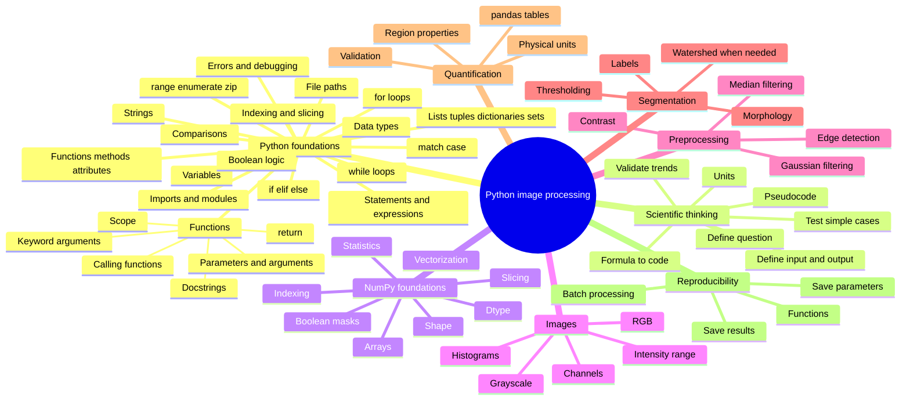
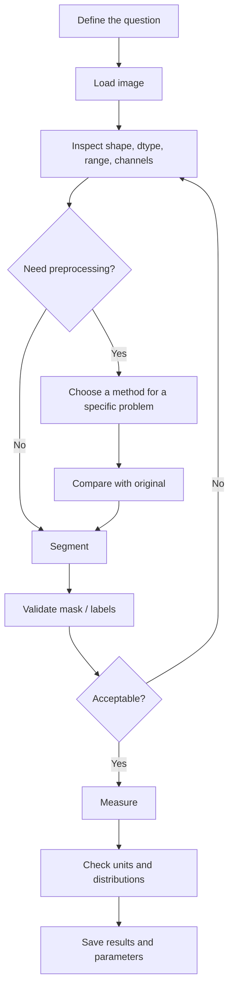

# Python Image Processing: A Practical Beginner Course

**Author: Md. Mobarak Karim, Ph.D.**

A beginner-friendly course for learning **Python and image processing together**, from zero programming knowledge to a complete image-analysis workflow.

You do **not** need previous Python experience. The course begins with programming concepts, scientific problem solving, and translating mathematical equations into code before moving into NumPy and image processing.

The main libraries are **NumPy**, **Matplotlib**, **scikit-image**, **pandas**, and **imageio**.

## Learning philosophy

This course is designed around understanding, not copying code.

For every important operation, ask:

1. **What problem am I trying to solve?**
2. **What are my inputs and desired output?**
3. **What equation or logical rule describes the problem?**
4. **How do I translate that rule into Python?**
5. **Why is this function appropriate?**
6. **Which parameter controls its behavior?**
7. **How will I validate the result?**

The core programming habit is:

```text
question → concept/equation → inputs/units → pseudocode → Python → test → validate → apply
```

The core image-analysis workflow is:

```text
question → understand data → choose method → inspect result → validate → measure → save
```

## Learning mind map



## Course order

| Notebook | Topic | What you learn |
|---|---|---|
| [`00_setup_and_workflow.ipynb`](00_setup_and_workflow.ipynb) | Setup + workflow | Environment, Jupyter, analysis habits, overall image-processing logic |
| [`01_python_numpy_for_images.ipynb`](01_python_numpy_for_images.ipynb) | **Complete Python foundation + scientific reasoning + NumPy** | Python from zero, variables, types, collections, logic, conditions, loops, functions, imports, debugging, formula-to-code reasoning, pseudocode, units, NumPy, arrays, slicing, masks, and image-array thinking |
| [`02_read_display_and_image_types.ipynb`](02_read_display_and_image_types.ipynb) | Read/display/types | Grayscale/RGB, dtype, intensity ranges, safe image I/O |
| [`03_contrast_histograms_and_intensity.ipynb`](03_contrast_histograms_and_intensity.ipynb) | Histograms + contrast | Intensity distributions, percentiles, display vs data modification |
| [`04_filtering_noise_and_edges.ipynb`](04_filtering_noise_and_edges.ipynb) | Filtering + edges | Gaussian vs median filtering, noise, Sobel edges, parameter trade-offs |
| [`05_thresholding_and_morphology.ipynb`](05_thresholding_and_morphology.ipynb) | Thresholding + morphology | Global/local thresholds, binary masks, cleanup |
| [`06_segmentation_and_labels.ipynb`](06_segmentation_and_labels.ipynb) | Segmentation + labels | Connected components, overlays, watershed when needed |
| [`07_measurements_and_tables.ipynb`](07_measurements_and_tables.ipynb) | Measurements | `regionprops_table`, pandas, object statistics, physical units |
| [`08_color_and_multichannel_images.ipynb`](08_color_and_multichannel_images.ipynb) | Color + multichannel | RGB vs scientific channels, channel-specific analysis |
| [`09_batch_processing_pipeline.ipynb`](09_batch_processing_pipeline.ipynb) | Batch pipeline | Reusable functions, explicit parameters, multiple images |
| [`10_final_project.ipynb`](10_final_project.ipynb) | Final project | End-to-end segmentation, validation, measurement, saving results |

## Notebook 01 is the standalone Python prerequisite

[`01_python_numpy_for_images.ipynb`](01_python_numpy_for_images.ipynb) is intentionally much more detailed than the later notebooks. A complete beginner should be able to study it without first leaving this repository for a separate Python course.

It explains:

- what Python statements and expressions are,
- comments and indentation,
- variables and meaningful scientific variable names,
- `int`, `float`, `str`, `bool`, and `None`,
- type conversion,
- arithmetic operators and order of operations,
- strings and f-strings,
- lists, tuples, dictionaries, and sets,
- zero-based indexing and slicing,
- comparison operators,
- `and`, `or`, and `not`,
- `if`, `elif`, and `else`,
- `match / case`,
- `for` loops and `while` loops,
- `range()`, `enumerate()`, and `zip()`,
- `break` and `continue`,
- list comprehensions,
- what it means to **call a function**,
- built-in vs library functions,
- positional and keyword arguments,
- how to define a function using `def`,
- parameters vs arguments,
- default parameters,
- `return`,
- returning multiple values,
- local variables and scope,
- docstrings,
- imports and modules,
- functions vs methods vs attributes,
- file paths using `pathlib`,
- common Python errors,
- a practical debugging workflow,
- `try / except`,
- assertions,
- how to turn a scientific question into a plain-language algorithm,
- how to write pseudocode before Python,
- how to translate an original mathematical formula into code,
- how to identify formula inputs and outputs,
- how to preserve parentheses and order of operations,
- how to keep track of physical units,
- how to test equations using known/simple cases,
- how to check whether the output trend is physically reasonable,
- example formula implementations for circle area, a linear model, exponential attenuation, Euclidean distance, min–max normalization, a Gaussian equation, and pixel-to-physical-area conversion,
- NumPy arrays,
- array shape and dtype,
- `[row, column]` image indexing,
- image cropping,
- vectorized operations,
- Boolean masks,
- array statistics,
- applying those ideas to an actual image,
- practice problems and worked solutions.

The main idea is not merely **how to type Python**, but **how to convert an idea, equation, or experiment into reliable code**.

## Installation

### Option A — Miniforge / conda

```bash
conda env create -f environment.yml
conda activate pyimage-beginner
jupyter lab
```

### Option B — `venv` + pip

```bash
python -m venv .venv

# Windows
.venv\Scripts\activate

# macOS / Linux
source .venv/bin/activate

python -m pip install -r requirements.txt
jupyter lab
```

## How to study the notebooks

For each lesson:

1. Read the explanation before the code.
2. Predict what a code cell should do.
3. Run it.
4. Inspect the output.
5. Change one parameter or value.
6. Explain what changed and why.
7. Complete the practice section before moving on.

For mathematical code, add three more habits:

1. Write the original equation first.
2. State every symbol and unit.
3. Test the Python implementation using a case you can verify manually.

A learner who understands **why** a line is present can adapt it to a new experiment. A learner who only copies the line usually cannot.

## Core image-analysis workflow



## Companion guides

- [`FUNCTION_GUIDE.md`](FUNCTION_GUIDE.md) — which image-processing function to try, when, why, and what parameter matters.
- [`CHEATSHEET.md`](CHEATSHEET.md) — quick syntax reference after you understand the concept.
- [`REFERENCES.md`](REFERENCES.md) — official documentation used to cross-check the course.

## Data policy

The core lessons use built-in `skimage.data` examples and synthetic image data so the repository stays lightweight and reproducible.

When using your own research images:

- work on copies,
- keep raw data unchanged,
- do not commit private or unpublished data to a public repository,
- preserve metadata needed for quantitative interpretation.

## Scope

The image-processing portion is **beginner-to-practical** and intentionally stops before deep learning, registration, deconvolution, GPU acceleration, and large 3-D/4-D datasets. Those topics become easier once the Python and image-analysis fundamentals here are comfortable.

## Author

**Md. Mobarak Karim, Ph.D.**  
GitHub: [Mobarak-Karim](https://github.com/Mobarak-Karim)

## Technical references

The course structure and function usage were cross-checked against current official documentation:

1. Python Tutorial — https://docs.python.org/3/tutorial/
2. NumPy documentation — https://numpy.org/doc/stable/
3. scikit-image User Guide — https://scikit-image.org/docs/stable/user_guide/
4. scikit-image NumPy for Images — https://scikit-image.org/docs/stable/user_guide/numpy_images.html
5. scikit-image Thresholding Guide — https://scikit-image.org/docs/stable/auto_examples/applications/plot_thresholding_guide.html
6. scikit-image API — https://scikit-image.org/docs/stable/api/skimage
7. Matplotlib documentation — https://matplotlib.org/stable/
8. Jupyter — https://jupyter.org/

## License

See `LICENSE` and `NOTICE.md`.
