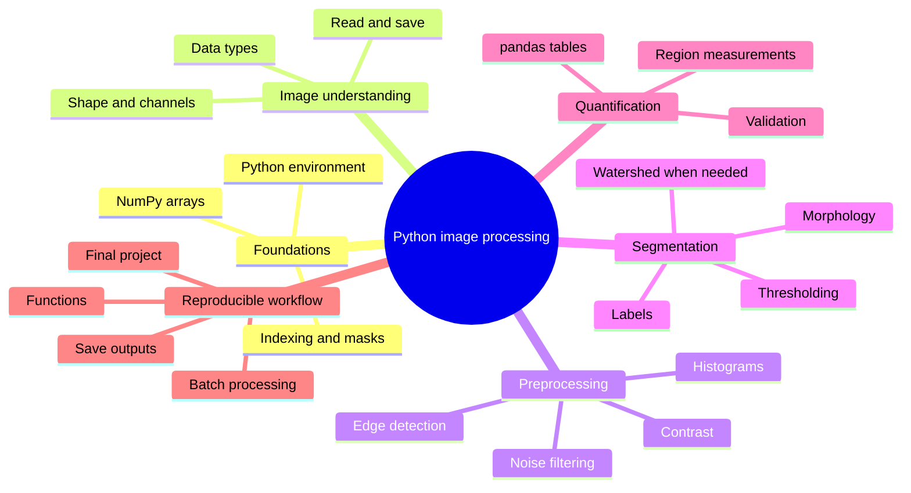
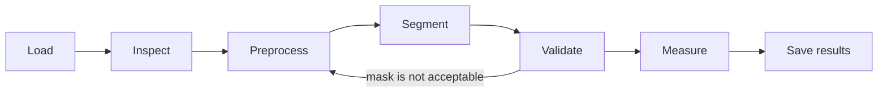

# Python Image Processing: A Practical Beginner Course

**Author: Md. Mobarak Karim, Ph.D.**

A compact, hands-on introduction to image processing in Python using **NumPy**, **Matplotlib**, **scikit-image**, **pandas**, and **imageio**. The course is written for beginners who want to move quickly from "I can open an image" to a small, reproducible analysis pipeline.

The emphasis is practical: inspect the data first, make one processing decision at a time, visualize intermediate results, and measure only after validating the segmentation.

## What makes this version different

- A new, original course structure and examples rather than a copy of the upstream notebooks.
- Smaller, self-contained notebooks with more comments and short exercises.
- Different example images from `skimage.data` plus a synthetic two-channel fluorescence image generated in code.
- A complete learning path from NumPy basics to batch processing.
- Biomedical-imaging habits are introduced without turning the course into an advanced microscopy class.
- No large external image folder is required for the core lessons.

## Learning mind map



If the mind map does not render in a local Markdown viewer, open the README on GitHub, which supports Mermaid diagrams in Markdown.

## Course order

| Notebook | Topic | Main result |
|---|---|---|
| `00` | Setup and workflow | A working environment and analysis habit |
| `01` | Python + NumPy | Crops, masks, statistics, array thinking |
| `02` | Read/display/types | Correct handling of dtype, range, RGB/grayscale |
| `03` | Histograms + contrast | Intensity inspection and display enhancement |
| `04` | Filtering + edges | Noise reduction and edge maps |
| `05` | Thresholding + morphology | Clean binary masks |
| `06` | Segmentation + labels | Individual labeled objects |
| `07` | Measurements | pandas-ready region tables |
| `08` | Color + multichannel | Channel-aware analysis and synthetic fluorescence |
| `09` | Batch pipeline | One reusable analysis function across images |
| `10` | Final project | End-to-end segmentation and measurement |

## Installation

### Option A — Miniforge / conda (recommended for scientific Python)

```bash
conda env create -f environment.yml
conda activate pyimage-beginner
jupyter lab
```

### Option B — pip

```bash
python -m venv .venv
# Windows: .venv\Scripts\activate
# macOS/Linux: source .venv/bin/activate
python -m pip install -r requirements.txt
jupyter lab
```

## How to use the course

Start with `notebooks/00_setup_and_workflow.ipynb` and move in numerical order. For each notebook:

1. Run the example as written.
2. Inspect the output rather than only checking whether the code ran.
3. Change one parameter.
4. Explain what changed and why.
5. Complete the short exercise before moving on.

For your own research images, place **copies** in `data/raw/`. Keep originals elsewhere and never use a teaching notebook as the only copy of experimental data.

## Core workflow to remember



## Scope

This course intentionally stops before deep learning, registration, deconvolution, GPU acceleration, large 3-D datasets, and production software engineering. Those are important topics, but they make more sense after the workflow here is comfortable.

## Data and image policy

The notebooks mainly use example images provided by `skimage.data`, a curated set intended for examples and documentation, and one synthetic fluorescence image created directly with NumPy/scikit-image. No Human Protein Atlas images from the upstream beginner course are included in this rewrite.

When adding your own images, document the source, license/permission, acquisition context, and any preprocessing that changes quantitative pixel values.

## Author

**Md. Mobarak Karim, Ph.D.**  
GitHub: [Mobarak-Karim](https://github.com/Mobarak-Karim)

## Course design sources

The lesson order and technical recommendations were cross-checked against current official documentation:

1. scikit-image User Guide — https://scikit-image.org/docs/stable/user_guide/
2. scikit-image: Getting started — https://scikit-image.org/docs/stable/user_guide/getting_started
3. scikit-image: NumPy for images — https://scikit-image.org/docs/stable/user_guide/numpy_images.html
4. scikit-image example gallery — https://scikit-image.org/docs/stable/auto_examples/
5. NumPy learning resources — https://numpy.org/learn/
6. Jupyter installation guide — https://jupyter.org/install
7. GitHub Mermaid diagrams — https://docs.github.com/en/get-started/writing-on-github/working-with-advanced-formatting/creating-diagrams

## Upstream note

This GitHub repository originated as a fork of `guiwitz/PyImageCourse_beginner`, which inspired the idea of a short beginner image-processing course. The current course files, lesson sequence, explanatory text, and examples in this rewrite were independently written and reorganized. Historical commits may still contain upstream material under its original terms.

## License

New course material in this rewrite is released under the MIT License. See `LICENSE` and `NOTICE.md`.
