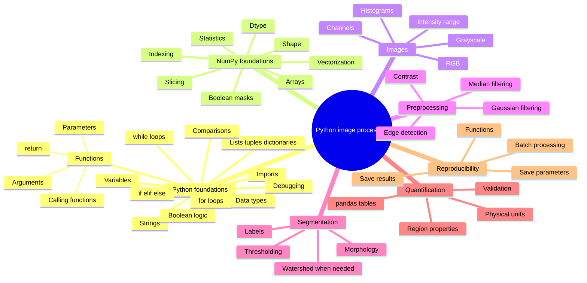
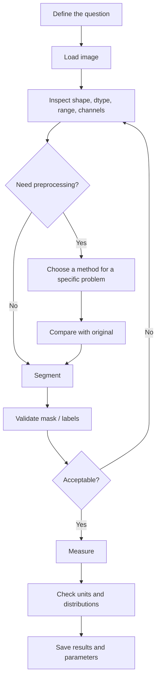

# Python Image Processing: A Practical Beginner Course

**Author: Md. Mobarak Karim, Ph.D.**

A beginner-friendly course for learning **Python and image processing together**, from basic programming syntax to a complete image-analysis workflow.

You do **not** need previous Python experience. The course starts with variables, data types, logic, loops, functions, imports, debugging, and NumPy before moving into image processing.

The main libraries are **NumPy**, **Matplotlib**, **scikit-image**, **pandas**, and **imageio**.

## Learning philosophy

This course is designed around understanding, not copying code.

For each important operation, ask:

1. **What problem am I trying to solve?**
2. **Why is this function appropriate?**
3. **Which parameter controls its behavior?**
4. **What should I inspect afterward?**

The core workflow is:

```text
question → understand data → choose method → inspect result → validate → measure → save
```

## Learning mind map



## Course order

| Notebook | Topic | What you learn |
|---|---|---|
| [`00_setup_and_workflow.ipynb`](00_setup_and_workflow.ipynb) | Setup + workflow | Environment, Jupyter, analysis habits, overall image-processing logic |
| [`01_python_numpy_for_images.ipynb`](01_python_numpy_for_images.ipynb) | **Python fundamentals + NumPy** | Variables, types, lists, dictionaries, `if/else`, Boolean logic, loops, function calls, writing functions, imports, errors/debugging, arrays, slicing, masks |
| [`02_read_display_and_image_types.ipynb`](02_read_display_and_image_types.ipynb) | Read/display/types | Grayscale/RGB, dtype, intensity ranges, safe image I/O |
| [`03_contrast_histograms_and_intensity.ipynb`](03_contrast_histograms_and_intensity.ipynb) | Histograms + contrast | Intensity distributions, percentiles, display vs data modification |
| [`04_filtering_noise_and_edges.ipynb`](04_filtering_noise_and_edges.ipynb) | Filtering + edges | Gaussian vs median filtering, noise, Sobel edges, parameter trade-offs |
| [`05_thresholding_and_morphology.ipynb`](05_thresholding_and_morphology.ipynb) | Thresholding + morphology | Global/local thresholds, binary masks, cleanup |
| [`06_segmentation_and_labels.ipynb`](06_segmentation_and_labels.ipynb) | Segmentation + labels | Connected components, overlays, watershed when needed |
| [`07_measurements_and_tables.ipynb`](07_measurements_and_tables.ipynb) | Measurements | `regionprops_table`, pandas, object statistics, physical units |
| [`08_color_and_multichannel_images.ipynb`](08_color_and_multichannel_images.ipynb) | Color + multichannel | RGB vs scientific channels, channel-specific analysis |
| [`09_batch_processing_pipeline.ipynb`](09_batch_processing_pipeline.ipynb) | Batch pipeline | Reusable functions, explicit parameters, multiple images |
| [`10_final_project.ipynb`](10_final_project.ipynb) | Final project | End-to-end segmentation, validation, measurement, saving results |

## What Notebook 01 now covers

Notebook `01_python_numpy_for_images.ipynb` is the programming foundation of the course. It now explains:

- what a variable is,
- `int`, `float`, `str`, and `bool`,
- arithmetic and comparison operators,
- strings and f-strings,
- lists, tuples, and dictionaries,
- indexing and slicing,
- `if`, `elif`, `else`,
- `and`, `or`, `not`,
- `for` loops,
- `range()` and `enumerate()`,
- `while` loops,
- what it means to **call a function**,
- positional vs keyword arguments,
- how to define a function with `def`,
- parameters vs arguments,
- how `return` works,
- imports and dot notation,
- common Python errors and debugging,
- NumPy arrays,
- `[row, column]` indexing,
- vectorized operations,
- Boolean image masks,
- applying all of those ideas to a real image.

The notebook has extensive explanatory comments and connects every Python concept to a practical image-processing use.

## Installation

### Option A — Miniforge / conda

```bash
conda env create -f environment.yml
conda activate pyimage-beginner
jupyter lab
```

### Option B — `venv` + pip

```bash
python -m venv .venv

# Windows
.venv\Scripts\activate

# macOS / Linux
source .venv/bin/activate

python -m pip install -r requirements.txt
jupyter lab
```

## How to study the notebooks

For each lesson:

1. Read the explanation before the code.
2. Predict what a code cell should do.
3. Run it.
4. Inspect the output.
5. Change one parameter or value.
6. Explain what changed and why.
7. Complete the practice section before moving on.

A learner who understands **why** a line is present will be able to adapt the code to a new image. A learner who only copies the line usually cannot.

## Core image-analysis workflow



## Companion guides

- [`FUNCTION_GUIDE.md`](FUNCTION_GUIDE.md) — which function to try, when, why, and what parameter matters.
- [`CHEATSHEET.md`](CHEATSHEET.md) — quick syntax reference after you understand the concept.
- [`REFERENCES.md`](REFERENCES.md) — official documentation used to cross-check the course.

## Data policy

The core lessons use built-in `skimage.data` examples and synthetic image data so the repository stays lightweight and reproducible.

When using your own research images:

- work on copies,
- keep raw data unchanged,
- do not commit private or unpublished data to a public repository,
- preserve metadata needed for quantitative interpretation.

## Scope

This is a **beginner-to-practical** course. It intentionally stops before deep learning, registration, deconvolution, GPU acceleration, and large 3-D/4-D datasets. Those topics become easier once the fundamentals here are comfortable.

## Author

**Md. Mobarak Karim, Ph.D.**  
GitHub: [Mobarak-Karim](https://github.com/Mobarak-Karim)

## Technical references

The course structure and function usage were cross-checked against current official documentation:

1. scikit-image User Guide — https://scikit-image.org/docs/stable/user_guide/
2. scikit-image NumPy for Images — https://scikit-image.org/docs/stable/user_guide/numpy_images.html
3. scikit-image Thresholding Guide — https://scikit-image.org/docs/stable/auto_examples/applications/plot_thresholding_guide.html
4. scikit-image API — https://scikit-image.org/docs/stable/api/skimage
5. NumPy documentation — https://numpy.org/doc/stable/
6. Python tutorial — https://docs.python.org/3/tutorial/
7. Matplotlib documentation — https://matplotlib.org/stable/
8. Jupyter — https://jupyter.org/

## License

See `LICENSE` and `NOTICE.md`.
